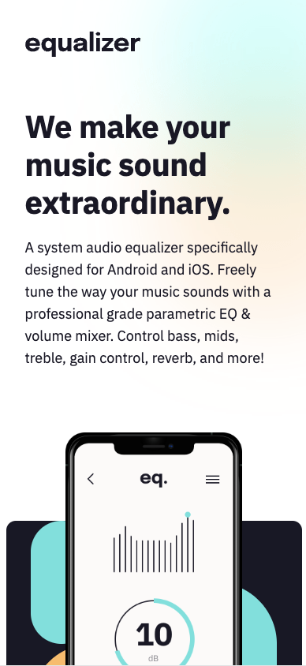
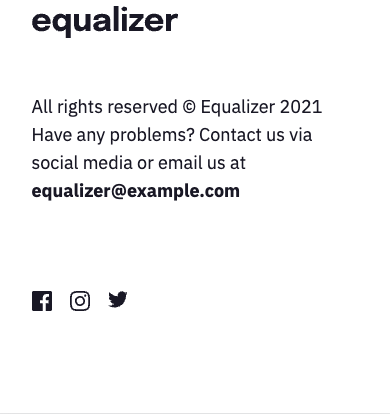
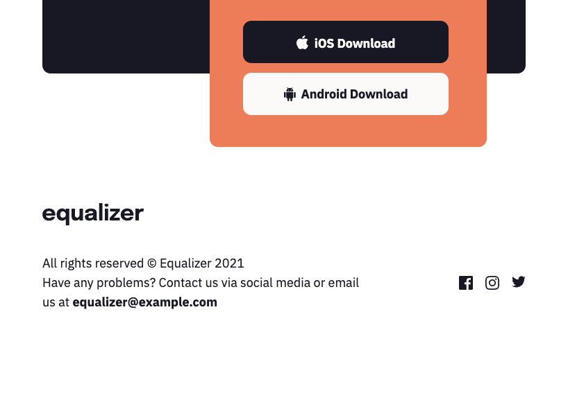
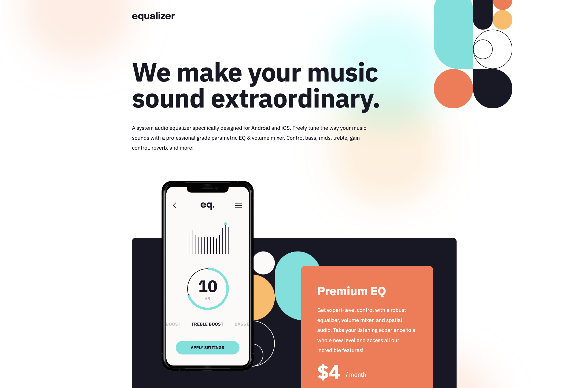
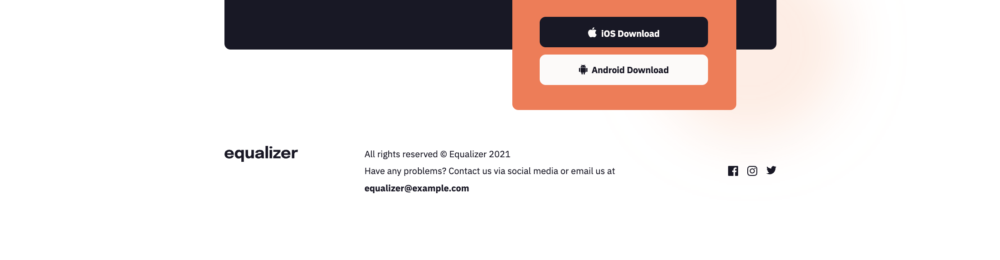

# Equalizer landing page

This repository contains an implementation of one of the Frontend Mentor Challenges - [Equalizer landing page](https://www.frontendmentor.io/challenges/equalizer-landing-page-7VJ4gp3DE) using HTML/CSS ([TailwindCSS](https://tailwindcss.com)).

## Overview

### The Challenge

[Equalizer landing page](https://www.frontendmentor.io/challenges/equalizer-landing-page-7VJ4gp3DE) was the third [Frontend Mentor](https://www.frontendmentor.io) challenge I had ever built. And it had also been the most complex one so far.

Whilst still using HTML/CSS ([TailwindCSS](https://tailwindcss.com)), I was required to make a few custom tweaks regards to position of background images and I learned a lot.

Let me talk about the solution more in next few sections.

### Screenshots

There are a few screenshots captured within the various screen sizes. I decided to restrict the max-width of the content and center it for each resolution.

Choosing this approach allowed me to keep the main design constrains in place and have a beautiful design in every resolution.

#### Mobile Version

This is the **mobile version** as displayed on **iPhone 12 Pro** (split into three images).





#### Tablet Version

This is the **tablet version** as displayed on **iPad Air** (split into two images).




#### Desktop Version

This is the **desktop version** as displayed on a large screen (split into two images).




### Links

- Solution URL: [https://github.com/radektomasek/fm-equalizer-landing-page](https://github.com/radektomasek/fm-equalizer-landing-page)
- Live Site URL: [https://radektomasek.github.io/equalizer-landing-page](https://radektomasek.github.io/equalizer-landing-page)

## My process

Building [this challenge](https://www.frontendmentor.io/challenges/equalizer-landing-page-7VJ4gp3DE) was a big fun. And given my professional experience with the CSS and the fact, this challenge is still considered as a Newbie one, I definitely learned quite a lot.

### Built with

- Semantic HTML5 markup
- CSS Grid
- Mobile-first workflow
- [Parcel](https://parceljs.org) - a simple, zero config builder
- [TailwindCSS](https://tailwindcss.com) - TailwindCSS for styles

### What I learned

I actually learned a lot as I worked with the background images a lot. They are not difficult to work with vanilla CSS, however, in TailwindCSS the default constrains are quite restrictive. However, I learned there is an easy way how to customize the position of background images using things such as:

```css
bg-[POSITION1_VALUE1_UNIT1_POSITION2_VALUE2_UNIT2]
```

e.g

```css
bg-[right_-15rem_top_-14rem]
```

This easily tweak the background image position into the desired spot.

> Note: Of course, it's also possible to override the stuff in `tailwind.config.js`, but for most of the things I prefer original settings.

Another thing I learned was that the [Frontend Mentor](https://www.frontendmentor.io) don't explicitly specify what happen in resolution change in between breakpoints and/or exceeding the largest constrainst. It's quite fun to bring some creativity and try to figure out the best experience.

### Continued development

Despite the best effort to setup things in advance (override the default TailwindCSS options inside `tailwind.config.js`), **I figured out that the advance Frontend Mentor projects contain a lot of pieces requiring very minor tweaks compare to original constrains**.

They are all visible in Figma, but for me it's difficult to get everything perfectly right during initial exploration. **As a result, I create a lot of artbitrary values** and I certainly see a lot of duplicites among them.

In the next project I will group these arbitrary values into CSS variables and try to use them inside the Tailwind. I feel they might improve the readability of the whole CSS file.

**I also still try to figure out the best way how to work with the CSS Grid within the scope of TailwindCSS**. I am comfortable with the CSS Grid in vanilla CSS, but when in comes to TailwindCSS does, it seems there are a few things happening behind the scenes which results into tweaking things a bit.

What works for me the most is to setup the most basic grid and apply other common utility classes for padding and margin to get the desired layout. **I wonder whether there is a possibility to dynamically set the sizes of cell, utilizing things like minmax(Xpx, Xfr)**?

### Useful resources

- [https://www.tailwindgen.com](https://www.tailwindgen.com) - This tool is very useful for generating the CSS Grid using TailwindCSS utility classes.

## Author

- Frontend Mentor - [@radektomasek](https://www.frontendmentor.io/profile/radektomasek)
- Linkedin - [radektomasek](https://www.linkedin.com/in/radektomasek)
- Twitter - [@radek_tomasek](https://twitter.com/radek_tomasek)
